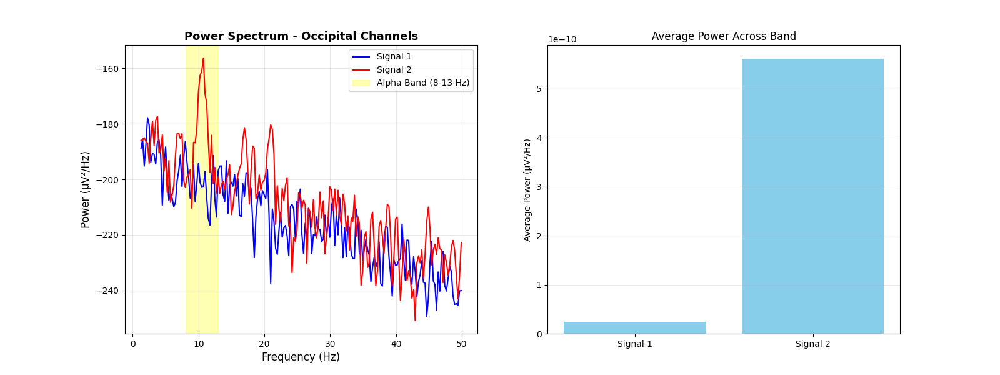
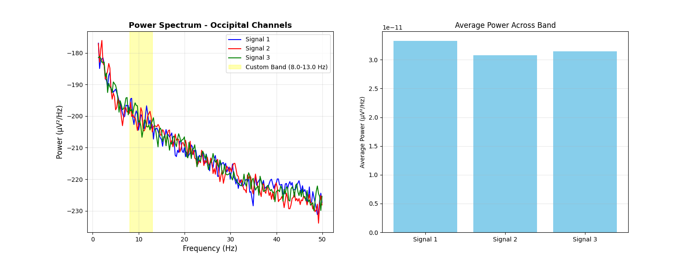
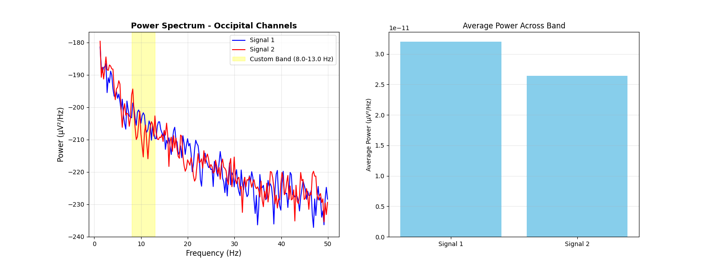

# EEG Signal Processing Pipeline

Python tool for analyzing brain activity from the PhysioNet motor imagery dataset. Computes power spectral density to examine frequency bands of brain activity and observe patterns during motor tasks.

After extracting raw time-domain signals from the 64-channel EEG dataset, I applied filtering and preprocessing to enhance signal quality and analyze power spectral density. By isolating specific electrodes, epochs, and frequency bands across different test runs, notable differences were observed in:
  - Eyes open vs eyes closed
  - Right vs left hand movements
  - Additional contrasts related to motor imagery tasks

I developed versions 1, 2, and 3 of the python script, verifying correct behavior on sample data. After realizing that an object-oriented may be better suited for the task, I enlisted the help of a large language model to refactor the code. After thorough testing and several adjustments, I confirmed that the refactored version produced results consistent with the earlier scripts. This object oriented version allows for scalability and simplifies reuse.


## Installation

```bash
pip install numpy matplotlib mne
```

## Basic Usage

```bash
python eeg_analyzer.py [options] file1.edf file2.edf ...
```

### Main Arguments

- `--channels`: Electrodes to analyze (e.g., `C3.. C4.. Cz..`)
- `--epochs`: Events to include - `T0` (rest), `T1` (left/both fists), `T2` (right/both feet)
- `--band`: Frequency range - named (`alpha`, `beta`, etc.) or custom (`8 13`)
- `--show_bar`: Show bar chart comparing power across files
- `--save_fig`: Save plot to file

## Example Commands

### Motor cortex during hand movements
```bash
python eeg_analyzer.py --channels C3.. C4.. --epochs T1 T2 --band 8 13 --show_bar \
  S001/S001R03.edf S001/S001R04.edf
```

### Occipital alpha rhythm (eyes closed)
```bash
python eeg_analyzer.py --channels O1.. Oz.. O2.. --epochs T0 --band alpha \
  S001/S001R02.edf
```

### Custom frequency band
```bash
python eeg_analyzer.py --channels C3.. --epochs T1 --band 12.5 16 \
  S001/S001R03.edf
```

## Sample Output Plots

### Eyes Open vs Eyes Closed


*Eyes open, alpha rythm is suppressed (left), eyes closed (right) - strong alpha rythm in occipital channels*

<!-- ### Contralateral Motor Cortex Activity - Real vs Imagined


*Contralateral motor cortex activity during hand movement tasks. Active movment shows consistently high power*


*Activity during imagined hand movement tasks. Active movment (left figure), imagined movement (right figure)* -->


*Activity during hand movement tasks (see table 1 below). Signal 1 - single hand movement; Signal 2 - repeated (1) with imagined movement; Signal 3 - both hands movement; Signal 4 - repeated (3) with imagined movement*

Additional figures are available in the `output_plots` directory, named using the following convention: `<subject>_<channels>_<band>_<epochs>_<runs>_<task-description>.png`

## Dataset Structure

Description of motor movement/imagery dataset from source: https://physionet.org/content/eegmmidb/1.0.0/
```
Experimental Protocol
Subjects performed different motor/imagery tasks while 64-channel EEG were recorded using the BCI2000 system (http://www.bci2000.org). Each subject performed 14 experimental runs: two one-minute baseline runs (one with eyes open, one with eyes closed), and three two-minute runs of each of the four following tasks:

  - A target appears on either the left or the right side of the screen. The subject opens and closes the corresponding fist until the target disappears. Then the subject relaxes.
  - A target appears on either the left or the right side of the screen. The subject imagines opening and closing the corresponding fist until the target disappears. Then the subject relaxes.
  - A target appears on either the top or the bottom of the screen. The subject opens and closes either both fists (if the target is on top) or both feet (if the target is on the bottom) until the target disappears. Then the subject relaxes.
  - A target appears on either the top or the bottom of the screen. The subject imagines opening and closing either both fists (if the target is on top) or both feet (if the target is on the bottom) until the target disappears. Then the subject relaxes.
```

In summary, the experimental runs for each subject are as follows:

| Runs | Description | Events Available |
|------|-------------|------------------|
| R01 | Baseline, eyes open | T0 |
| R02 | Baseline, eyes closed | T0 |
| R03, R07, R11 | Real left/right fist movements | T0, T1, T2 |
| R04, R08, R12 | Imagined left/right fist movements | T0, T1, T2 |
| R05, R09, R13 | Real both fists/both feet | T0, T1, T2 |
| R06, R10, R14 | Imagined both fists/both feet | T0, T1, T2 |

**Event codes:**
- T0 = rest
- T1 = left fist (R03-04, R07-08, R11-12) or both fists (R05-06, R09-10, R13-14)
- T2 = right fist (R03-04, R07-08, R11-12) or both feet (R05-06, R09-10, R13-14)

**Note:** All input files must contain the events you specify, or the program will error.

## Key Electrodes

- **Motor cortex**: C3, Cz, C4 (left, center, right)
- **Occipital (visual)**: O1, Oz, O2
- **Frontal**: Fp1, Fpz, Fp2

## Code Structure

Built with object-oriented design:

- `EEGDataLoader` - loads EDF files
- `EEGPreprocessor` - applies filtering
- `PSDAnalyzer` - computes power spectral density
- `EEGVisualizer` - creates plots
- `EEGAnalysisPipeline` - orchestrates workflow

## Frequency Bands

- **delta**: 0.5-4 Hz
- **theta**: 4-8 Hz
- **alpha**: 8-13 Hz
- **beta**: 13-30 Hz
- **gamma**: 30-45 Hz

## Common Issues

**"Event not found" error**: Check that all your input files contain the requested events (see Dataset Structure).

**Invalid channel name**: Electrode names use specific formatting (e.g., `C3..` not `C3`).

## References

- PhysioNet Motor Imagery Dataset: https://physionet.org/content/eegmmidb/
- MNE-Python: https://mne.tools/